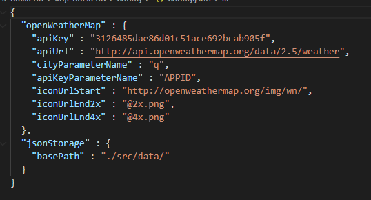
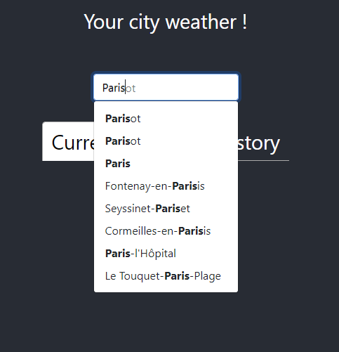
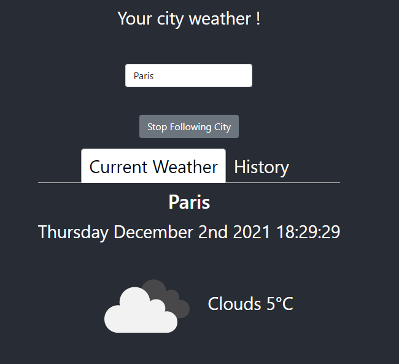
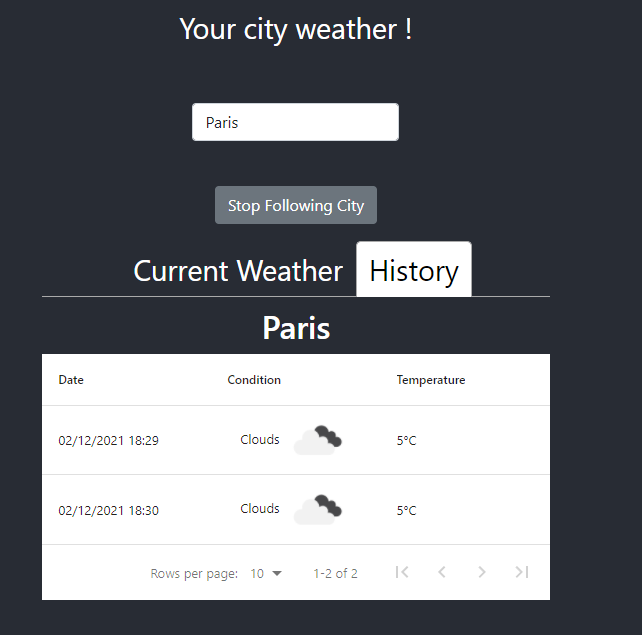
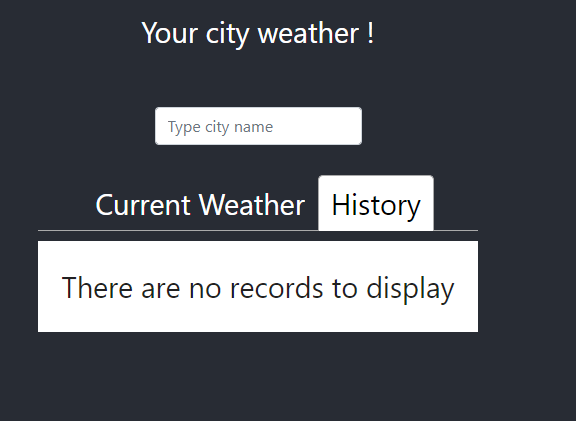

# Getting started

This document will help you to setup and run this application and covers the following topics:

<ul>
    <li>Setting up and backend</li>
    <ul>
        <li>Change API Key</li>
    </ul>
    <li>Setting up and frontend</li>
    <li>Using the application</li>
    <ul> 
        <li>Search city</li>
        <li>See current weather or history</li>
        <li>Stop following city</li>
    </ul>
</ul>

## Setting up Backend
The application is located in <code>koji-test-backend/koji-backend </code> directory

You can run it with npm. If so you will have to run the following commands:
<code>npm install
    nest start</code>

You can also use docker, a Dockerfile is present in the same directory. For more information check documentation from Docker: `https://docs.docker.com/engine/reference/commandline/build/#text-files`

The application will listen to `http://localhost:3010` and allow CORS for the frontend part only (`http://localhost:3000`). 

### Change API Key
You will probably want to change API Key. To do that you will have to access in <code>config.json</code> located at <code>koji-test-backend/koji-backend/config</code>

Just change the value <code>apiKey</code>

## Setting up Frontend
This part is located in <code>koji-test-frontend/koji-frontend</code> 

Like the backend part you can run it with npm or docker.

If you run with npm you will need to execute the following commands:
<code>npm install
    npm start</code>

## Using the application
Once the application is running you can do the following

### Search city
You can type the name of the city you are looking for. Once you have type 3 characters, you will be able to select a city by clicking on its name.

This action will trigger backend and in result show the current weather in the section named after.

This action will also store store two cookies:
<ul>
    <li>A unique identifier for your browser</li>
    <li>The last city you have searched</li>
</ul>

Those will be used the next time you get on the app and will preload data from your last research.

### See current weather or history
Once you have search a city it will be automatically followed. This will allow the server get every 10 minutes data for that city. Those data can be saw by clicking on the history tab.

### Stop following city
To stop following a city you can click on the name after button. This action will result on deleting data history and cookies (except your id) and clear both panels.

